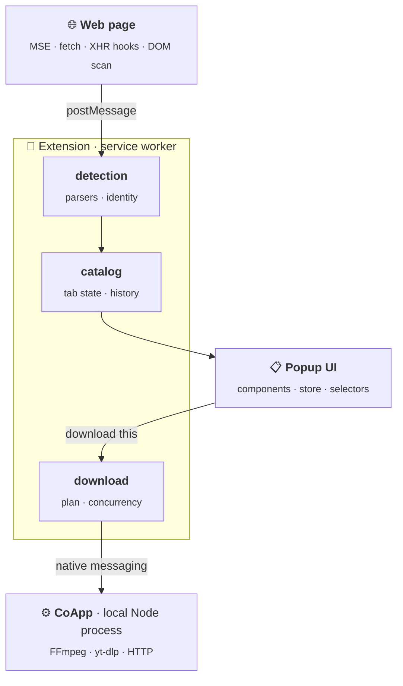

<p align="center">
  
</p>

<h1 align="center">Flux Downloader</h1>

<p align="center">
  Detect the media a page is streaming, pick a quality, save it locally.
</p>

<p align="center">
  
  
  
  
  
</p>

<p align="center">
  <sub>Chrome / Edge 102+ · Windows, macOS, Linux · no telemetry</sub>
</p>

---

https://github.com/user-attachments/assets/05a171ad-6ba6-4ab1-8d7c-9ef7cbdec57d

## What it does

A browser cannot write files or run FFmpeg, so Flux is two halves: a Manifest V3
extension that **finds** media, and a small local Node companion (CoApp) that
**fetches** it. They talk over Chrome native messaging.

| | |
|---|---|
| **Finds** | HLS (`.m3u8`), DASH (`.mpd`), direct MP4/WebM, `<video>` elements, and streams that only exist inside Media Source Extensions |
| **Understands** | Video, alternate audio and subtitle renditions, parsed from the manifest itself |
| **Downloads** | FFmpeg stream-copy for HLS/DASH, yt-dlp for YouTube, plain HTTP for direct files |
| **Organises** | One list across every open tab, optional history, grouping by the real source site, rename, search, reorder, batch download |

Media playing right now is pinned above history. A video keeps the page that
actually exposed it — a Rocketseat lesson stays under `app.rocketseat.com.br`
even though its bytes come from `b-cdn.net`.

> Flux does not bypass DRM. Download only what you are allowed to save.

## Install

Not on the Chrome Web Store — load it unpacked.

**1. Build it**

```bash
git clone https://github.com/miroshArtem/MediaGrabber.git
cd MediaGrabber
npm install
npm run build
```

**2. Load the extension**

Open `chrome://extensions`, turn on **Developer mode**, click **Load unpacked**,
and select the repository's `extension/` folder.

**3. Register the companion app**

```bash
cd coapp
node dist/native-autoinstall-cli.js register igephdkobpgbfgdjmehckbhffbimgkii
```

The extension ID is fixed by the manifest key, so it is always the one above.

**4. Make sure the tools are reachable**

`ffmpeg`, `ffprobe` and `yt-dlp` must be on your `PATH` (or under
`coapp/ffmpeg/<platform>/` and `coapp/ytdlp/<platform>/`).

```bash
brew install ffmpeg yt-dlp      # macOS
```

Reload the extension, then reload any page that was already open.

## How it works



Source is grouped by domain, and each folder carries its own `AGENTS.md`
explaining the rules that live there:

| Folder | Owns |
|---|---|
| [`entrypoints/`](extension/src/entrypoints) | Service worker, content script, MAIN-world hook |
| [`detection/`](extension/src/detection) | Page hooks, HLS/DASH parsers, media identity |
| [`catalog/`](extension/src/catalog) | Per-tab state, history and its persistence |
| [`download/`](extension/src/download) | Download plan, concurrency gate, native client |
| [`popup/`](extension/src/popup) | Component UI with its own store and selectors |
| [`coapp/src/`](coapp/src) | RPC, FFmpeg, yt-dlp, filesystem |

A few decisions worth calling out:

- **Media identity is a normalised key, not a URL.** Signed CDN links rotate
  their token on every visit, so matching raw strings would show one video
  twice.
- **The popup owns its own state, split from the background's.** A detection
  arriving mid-rename cannot wipe what you are typing.
- **One download run owns the CoApp at a time**, reserved synchronously before
  the first `await` — disabling buttons is feedback, not the lock.
- **The MAIN-world hooks stay invisible.** Patched APIs report native source and
  keep the extension out of error stacks, because a player that notices
  tampering stops rendering.

## Development

```bash
npm test          # 560 tests · Vitest + happy-dom
npm run build     # tsc + esbuild bundles, then the CoApp
npm run dev:extension
```

No linter and no runtime dependencies — just TypeScript, esbuild and Vitest.
Deeper notes live in [AGENTS.md](AGENTS.md) and [docs/](docs).

## Privacy

Everything stays on your machine. Settings and history use
`chrome.storage.local`; the CoApp only talks to the extension that registered
it. No analytics, no accounts, no servers.

<p align="center"><sub><a href="LICENSE">MIT</a></sub></p>
